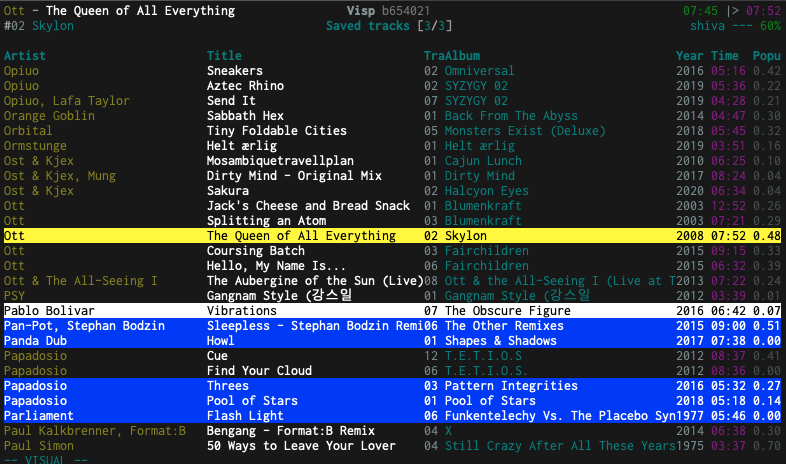

# Visp

[](https://github.com/ambientsound/visp/actions)
[](https://goreportcard.com/report/github.com/ambientsound/visp)
[](https://codecov.io/gh/ambientsound/visp/branch/master)
[](LICENSE)

Visp is an interactive console client for [Spotify](https://www.spotify.com), written in Go. Its interface is similar to Vim, and aims to be fast, configurable, and practical.
Visp means whisk, and just like the simple mechanical tool it makes it easy to create that smooth and perfect mixture through the power of manual control, and without any unfortunate lumps.

This interface has many features that involve sorting, searching, and navigating. It’s designed to let you navigate your music collection effectively and efficiently.

This project is a fork of [Practical Music Search](https://github.com/ambientsound/pms) and contains a lot of the same functionality,
but is geared towards Spotify instead of Music Player Daemon. Visp was born due to significant differences between the Spotify and MPD APIs.
Also, forking the project is a convenient opportunity to depart from the unfortunate acronym _PMS_.

Among currently implemented features are:

* Looks and feels like Vim!
* Can be configured to consume a very small amount of screen space.
* Control playback by playing or adding tracks or sets of tracks.
* A fully customizable layout, including player status, tag headers, text styles, colors, and keyboard bindings.
* Full access to all your private and public Spotify playlists and liked songs.
* Many forms of tracklist manipulation, such as select, cut, copy, paste, filter, sort, etc.
* Text configuration files, tab completion, history, and much more!


## Screenshot




## Getting started

Downloads for Linux, Mac OS X and Windows can be found on the [releases](https://github.com/ambientsound/visp/releases) page.

Visp is _beta software_ and is a work in progress. Testers are welcome.

If you're new to Visp, please start out by reading the [User Guide](doc/intro.md).

For in-depth information about configuration or advanced use, check out the [documentation](doc/README.md).


## Limitations

Visp requires a Spotify Premium account and will not work with free accounts.

Visp is not a player, but a controller, and is thus not capable of outputting sound.
You can run the official Spotify client in the background, play back on Spotify enabled devices,
and if you want a headless/server setup I can recommend the excellent
[librespot](https://github.com/librespot-org/librespot) or
[spotifyd](https://github.com/Spotifyd/spotifyd) projects.

As Visp is still beta, there are bugs and unimplemented features. These can be
reported in the [issue tracker](https://github.com/ambientsound/visp/issues).


## Contribution and contact

See [how to contribute to Visp](CONTRIBUTING.md).


## Developing

You’re assumed to have a working [Go development environment](https://golang.org/doc/install). Building Visp requires Go 1.16 or higher.

Assuming you have the `go` binary in your path, you can build Visp using:

```
git clone https://github.com/ambientsound/visp
cd visp
make
```

This will put the binary in `./bin/visp`.
You need to run Visp in a regular terminal with a TTY.

If Visp crashes, and you want to report a bug, please include relevant sections of the `debug.log` file,
located in the directory where you started Visp.


## Authors

Forked from [Practical Music Search](https://github.com/ambientsound/pms),
written by Kim Tore Jensen <<kimtjen@gmail.com>>, Bart Nagel <<bart@tremby.net>>,
and [others](https://github.com/ambientsound/pms/graphs/contributors).

Visp is written by Kim Tore Jensen <<kimtjen@gmail.com>>.

The source code and latest version can be found at Github:
<https://github.com/ambientsound/visp>.
